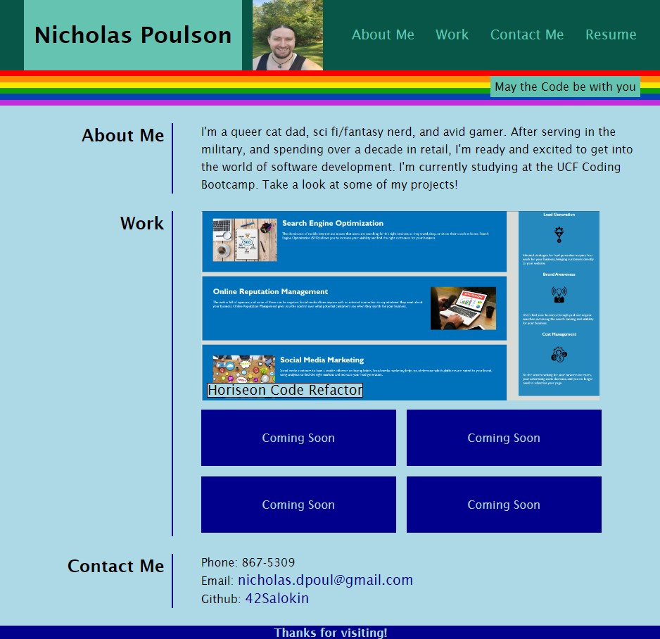

# My Development Portfolio

## Description

This is a portfolio of work to showcase my projects and skills. Using what I've learned so far about HTML and CSS, I put links in the header to scroll to the relevant About Me, Work, and Contact Me sections. The screenshot of my first project will take you to the deployed website. I'll be adding more projects as I go. 

## Installation

N/A

## Usage

Access updated website online at:

https://42salokin.github.io/portfolio/

## Credits

I frequently used advice from other developers in Stack Overflow and the information at W3schools to assist me with formatting and creating a responsive interface.

Pride flag code directly borrowed from Todd Barchok at http://barchok.com/flags.html

## License

Please refer to the LICENSE in the repo.
